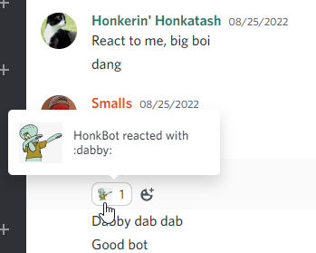
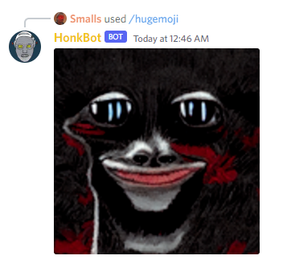
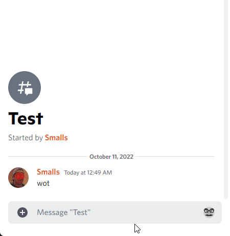
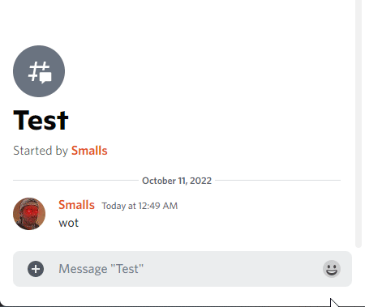
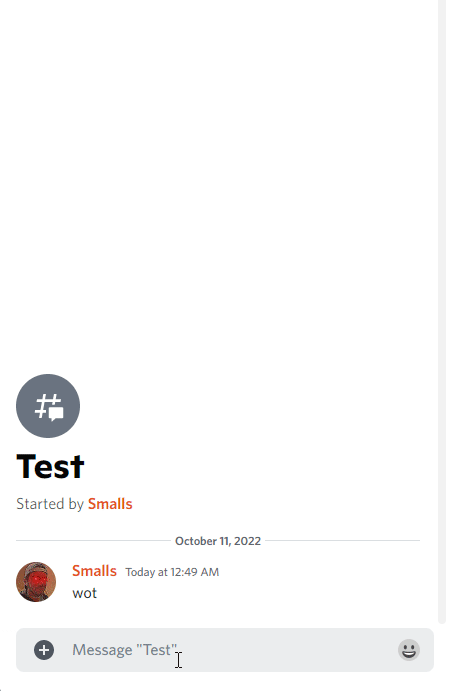

# HonkBot's Features

## Generic random message events

### Randomly add reactions to messages

HonkBot will randomly add reactions that are available in the server.

### Randomly drop a fart bomb to a message

HonkBot will have a really reaaaaaaally slim chance to drop a fart bomb video on a message.

## Slash commands

### `/hugemoji`

Make any emote, including animated emotes, honking huge.

### `/widemoji`

Much like [`/hugemoji`](#hugemoji)... Make any emote, including animated emote, wide. For some reason...

### `/roll-d20`

Roll a D20 dice and see if you pass/fail the check.

### `/sharemusic`

Get links to multiple music streaming services from a single share link from another streaming service. For example, you can use the share link for a song from Apple Music and get links to Spotify, YouTube, and more.

